# 进程控制
## 概念
即进程的状态转换
## 原子操作
进程转换使用**原子操作**实现
原因：避免某些关键数据在状态转换过程中出现信息不统一
###  实现方式
使用**关中断指令**和**开中断指令**实现
关中断指令：使cpu不再检查中断信号
开中断指令：使cpu恢复检查中断信号

## 创建进程
1. 申请空PCB
2. 为新进程分配空间
3. 初始化PCB
4. 将PCB插入就绪队列
### 终止进程
1. 在PCB队列中找到对应的PCB
2. 若正在运行，立即剥夺cpu，将cpu资源分配给其他进程
3. 终止所有子进程
4. 将该进程资源归还父进程或操作系统
5. 删除pcb
# 进程调度

## 多级反馈调度(MFQ)
当一个新进程到达，若果优先级高于当前进程，那么当前进程被抢占，被抢占进程进入原队列末尾
较高优先级

### 例子
有3个队列，时间片为1、2、4，A、B、C、D、E的到达时间为0、1、2、3、4、5，运行时间为3、8、4、5、7

```mermaid
gantt
    title 多级反馈队列 (MFQ) 调度图解
    dateFormat  X
    axisFormat  %M

    section 队列 Q1 (q=1)
    A :a1, 0, 1m
    B :b1, after a1, 1m
    C :c1, after b1, 1m
    D :d1, after c1, 1m
    E :e1, after d1, 1m

    section 队列 Q2 (q=2)
    A (完结) :done, a2, after e1, 2m
    B       :b2, after a2, 2m
    C       :c2, after b2, 2m
    D       :d2, after c2, 2m
    E       :e2, after d2, 2m

    section 队列 Q3 (q=4)
    B       :b3, after e2, 4m
    C (完结) :done, c3, after b3, 1m
    D (完结) :done, d3, after c3, 2m
    E       :e3, after d3, 4m
    B (完结) :done, b4, after e3, 1m
    E (完结) :done, e4, after b4, 1m

```

## 多级反馈队列（MLFQ）经典调度与抢占分析

### 核心调度规则解析

1. **严格优先级**：只要高优先级队列（如 Q0）有进程，低优先级队列（如 Q1, Q2）的进程**绝对不能运行**。
    
2. **抢占机制**：当低优先级进程正在运行时，如果高优先级队列有新进程到达（或从 I/O 唤醒归来），CPU 会被立即剥夺（抢占），交接给高优先级进程。被抢占的进程通常保留其剩余时间片，在原队列累计满时间片后才降级。
    
3. **I/O 密集型偏好**：为了保证交互式进程的响应速度，主动放弃 CPU 去做 I/O 的进程（如 $P_2$），在 I/O 完成被唤醒后，通常允许其回到原高优先级队列（本题中明确规定“加入原来队列”）。
### 例子

![[6872f2499bb9ff128501f6374955ed70.png]]

```mermaid
gantt
    title MLFQ 调度与 I/O 状态甘特图
    dateFormat  X
    axisFormat  %s

    section CPU 运行
    P1(Q0) :0, 8
    P1(Q1) :8, 10
    P2(Q0) :10, 18
    P1(Q1) :18, 20
    P3(Q0) :20, 28
    P2(Q0) :28, 36
    P1(Q1) :36, 40
    P2(Q0) :40, 48
    P1(Q1) :48, 56
    P3(Q1) :56, 60
    P1(Q2) :60, 76

    section I/O 设备
    P2(I/O 阻塞) :18, 22
    P2(I/O 阻塞) :36, 40
```

#### Q1：Q1 队列的时间片明明是 16ms，为什么 $P_1$ 降级到 Q1 后没有一口气运行 16ms？

**A**：$P_1$ 在 Q1 中**确实严格运行了 16ms**，但由于高优先级队列（Q0）不断有进程进入（$P_2$ 唤醒、$P_3$ 到达），$P_1$ 的运行被无情地“切碎”成了 4 段。

$P_1$ 在 Q1 的实际运行轨迹是累计的：**2ms + 2ms + 4ms + 8ms = 16ms**。直到第 56ms 时，它在 Q1 累计跑满了 16ms，才用尽时间片降级到 Q2（FCFS）。

#### Q2：在 28ms 时，为什么轮到 $P_2$ 运行而不是 $P_1$？而且为什么 $P_2$ 只运行了 8ms，不是 16ms？

**A**：

- **为什么是 $P_2$**：在 22ms 时，$P_2$ 结束了第一次 I/O，回到了最高优先级的 **Q0 队列**等待。到了 28ms 时，$P_3$ 用完时间片降级到 Q1。此时调度器检查队列，发现高优先级的 Q0 中有 $P_2$，而 $P_1$ 在低优先级的 Q1 中。根据严格优先级规则，必须先运行 Q0 中的 $P_2$。
    
- **为什么跑 8ms**：
    
    1. $P_2$ 身处 Q0，Q0 的时间片规定就是 8ms。
        
    2. $P_2$ 自身的运行模式是“每跑 8ms 就主动去进行 4ms 的 I/O”。因此它跑满 8ms 后就主动去阻塞了。
#### Q3：为什么 $P_2$ 每次做完 I/O 后，能够回到最高优先级的 Q0 队列？

**A**：

- **直接原因**：题目最后一行明确规定了“$P_2$ 每次唤醒后加入原来队列”。$P_2$ 初始从 Q0 入场，所以“老家”就是 Q0。
    
- **底层原理**：这是 MLFQ 操作系统的经典设计理念。系统会“偏爱” I/O 密集型进程。既然它在耗尽时间片之前主动交出 CPU，系统就不惩罚它（不降级），唤醒后让它留在高优先级队列，以确保极速响应。
    

#### Q4：在 36ms ~ 40ms 这个时间段，到底是谁在运行？为什么只运行了 4ms？

**A**：这段时间运行的是 **$P_1$**。

- **$P_2$ 的去向**：$P_2$ 在 28~36ms 跑满了 8ms 后，必须主动去进行 4ms 的 I/O（36ms~40ms 期间 $P_2$ 处于阻塞状态）。
    
- **趁虚而入的 $P_1$**：此时 Q0 空了，CPU 终于轮到 Q1 队列队头的 $P_1$ 运行。
    
- **为何被迫中止（只跑 4ms）**：$P_1$ 并非自愿只跑 4ms。当时间到达 40ms 时，$P_2$ 的 4ms I/O 刚好结束，并“满血复活”回到了 Q0。由于**抢占式调度**，$P_2$ 一回来就立刻把正在运行的 $P_1$ 踢下 CPU，所以 $P_1$ 只能被迫交出控制权，将这 4ms 记入自己的累计运行时间中。
# 多处理器架构
## cache一致性
cache行有M、E、S、I四个状态
监管机制——监管总线，如果cache行是M态，使用写直达协会主存，变为E态，若为E态使用写回法变成M态
### 缓存亲和度问题
进程/线程倾向于在某一个处理器上运行的问题